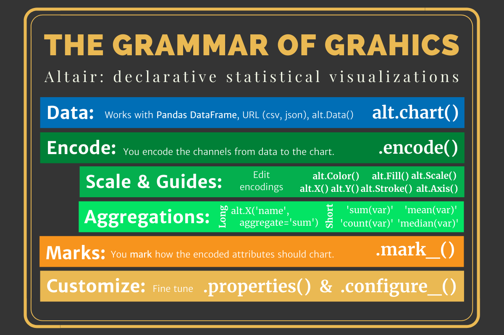

# Set up

```python
# import modules
import pandas as pd
import altair as alt
import numpy as np
# import data through url
url = "https://github.com/byuidatascience/data4missing/raw/master/data-raw/flights_missing/flights_missing.json"
flights = pd.read_json(url)
flights.head()
```

## Dataframe Info
```python
my_data.columns
my_data.shape
my_data.size
my_data.head()
my_data.describe()
```



## Merge two charts
```python
(alt.Chart(my_data)
   .mark_line()
   .encode(
      x = alt.X('year', axis = alt.Axis(format = 'd', title = "Year")), 
      y = alt.Y('Total', axis = alt.Axis(title = "Children with Name"))
    )
)

line_df = pd.DataFrame({'year': [1990]})
line_df

line = alt.Chart(line_df).mark_rule(color="red").encode(x = "year")

final_chart = question_1 + line
final_chart
```
### Simple chart

```python
alt.Chart(ttl).mark_bar().encode(
    y="airport_code",
    x="num_of_flights_total",
)
```

### sort_values
```python
df.sort_values(by=['col1', 'col2'], ascending=False, na_position='first')
```

### How to create a dataframe by myself

```python
data = {'airport_code':['ATL', 'DEN', 'IAD', 'ORD', 'SAN', 'SFO', 'SLC'],
        'PropOfDelay':[atlPropOfDelay, denPropOfDelay, iadPropOfDelay, ordPropOfDelay, sanPropOfDelay, sfoPropOfDelay, slcPropOfDelay]}

# Create DataFrame
df = pd.DataFrame(data)
```

### Chart: change a color conditionally

```pythonaa
```

### Store the chart in a png version

```python
chart_name.save("./imgs/whatever.png")
```

#### How to display in md file

```markdown

```

### Table data to markdown

```python
print(df.to_markdown(index = False))
```

### Rename a column name

```python
# %%
df.rename(columns = {'old': 'new'}, inplace=True)
```

### value_counts()

```python
index = pd.Index([3, 1, 2, 3, 4, np.nan])
index.value_counts(normalize=True, dropna=False)
```

### na

```python
# no duplicated values
flights.month.unique()
# num of pandas na in a dataframe
flights.isna().sum() 
flights.isnull().sum() 
# drop na from a dataframe
flights.dropna()
# Make a list storing indexes whose one of the rows have a specfic value
indexNames = flights[flights-^['num_of_delays_late_aircraft'] == -999 ].index
# Then, drop the rows
flights.drop(indexNames, inplace=True)
```

#### replace()

```python
(flights_copy
    .query("airport_code == 'IAD' & year==2006")
    .replace("n/a", "September", inplace=True))

# OR below
cars_new = cars.replace(999, np.nan).replace("", np.nan)
# or equivalently:
cars_new = cars.replace([999, ""], np.nan)
# did we get them all?
cars_new.isnull().sum()
```

### assign(): one way to add new columns to a dataframe

```python
flights_new = (flights
    .assign(
        weather_late_aircraft = round(
            flights.num_of_delays_late_aircraft * .3, 0))
            [[
                "num_of_delays_late_aircraft",
                "num_of_delays_nas",
                "num_of_delays_weather",
                "weather_late_aircraft"
            ]]
)
```

### chart: range

```python
alt.Chart(ttl).mark_point().encode(
    x=alt.X("year:Q",
            scale=alt.Scale(
                domain=[
                    flights.year.min() - 1,
                    flights.year.max() + 1
                ]
            )
    ),
    y=alt.Y("num_of_flights_total:Q"),
            color = alt.Color("airport_code:N", scale=alt.Scale(scheme='category10')
    ),
    shape='airport_code:N',
).interactive()

alt.Chart(sub_dat).mark_boxplot().encode(
  x = "gartype",
  y=alt.Y("yrbuilt",
    scale=alt.Scale(
      zero = False
    )
  ),
)
```


## Import sql file

```python

import pandas as pd
import sqlite3

con = sqlite3.connect('lahmansbaseballdb.sqlite')

df = pd.read_sql_query("SELECT * FROM fielding LIMIT 5", con)
df
```


## How to Change A Column Name
``` python
# By a column name
dat.rename(columns = {'RespondentID':'id'}, inplace = True)

# By an index
column_names = df.columns.values
column_names[2] = 'Changed'
df.columns = column_names
```

## Create A DF from A Dic. and Display A Chart
```python
q3_sum1 = {
  'movie_num':['I', 'II', 'III', 'IV', 'V', 'VI'],
  'percent':
          [
            round(len(at_least_watched_one.query("WatchedOne == 'Star Wars: Episode I  The Phantom Menace'")) / LEN * 100, 0), 
            round(len(at_least_watched_one.query("WatchedTw == 'Star Wars: Episode II  Attack of the Clones'")) / LEN * 100, 0),
            round(len(at_least_watched_one.query("WatchedTh == 'Star Wars: Episode III  Revenge of the Sith'")) / LEN * 100, 0), 
            round(len(at_least_watched_one.query("WatchedFr == 'Star Wars: Episode IV  A New Hope'")) / LEN * 100, 0), 
            round(len(at_least_watched_one.query("WatchedFv == 'Star Wars: Episode V The Empire Strikes Back'")) / LEN * 100, 0), 
            round(len(at_least_watched_one.query("WatchedSx == 'Star Wars: Episode VI Return of the Jedi'")) / LEN * 100, 0)
          ]
}
q3_sum1
df_q3_sum1 = pd.DataFrame.from_dict(q3_sum1)
bars = alt.Chart(df_q3_sum1).mark_bar().encode(
    y="movie_num",
    x="percent",
)
text = bars.mark_text(
  align="left", 
  baseline="middle", 
  dx = 3
).encode(
  text="percent:Q"
)

(bars + text).properties()
```

## Change An Axis Ttl
```python
alt.Chart(df).mark_circle().encode(
    x=alt.X('x', axis=alt.Axis(format='%', title='percentage')),
    y=alt.Y('y', axis=alt.Axis(format='$', title='dollar amount'))
)
```

## Sorted Bar Chart
```python
bars = alt.Chart(feature_df).mark_bar().encode(
    x="importance",
    # y="features", sort='-x',
    y=alt.Y("features", sort='-x')
)
bars
```


# ML

### Creating a subset
```python
h_subset = dwellings_ml.filter(['livearea', 'finbsmnt', 
    'basement', 'yearbuilt', 'nocars', 'numbdrm', 'numbaths', 
    'stories', 'yrbuilt', 'before1980']).sample(500)
```

### split
```python
x = dwellings_ml.filter(["what variables will you use as features?"])
y = dwellings_ml["what variable is the target?"]
x_train, x_test, y_train, y_test = train_test_split(x, y, test_size = .25, random_state = 10)

```

### Training a Classifier
```python
from sklearn.ensemble import RandomForestClassifier
from sklearn.ensemble import GradientBoostingClassifier
from sklearn.tree import DecisionTreeClassifier

# create the model
classifier = DecisionTreeClassifier()

# train the model
classifier.fit(x_train, y_train)

# make predictions
y_predictions = classifier.predict(x_test)

# test how accurate predictions are
metrics.accuracy_score(y_test, y_predictions)
```

### Plotting feature importance
```python 
#%% 
# Feature importance
classifier_DT.feature_importances_

#%%
feature_df = pd.DataFrame({'features':x.columns, 'importance':classifier_DT.feature_importances_})
feature_df
```