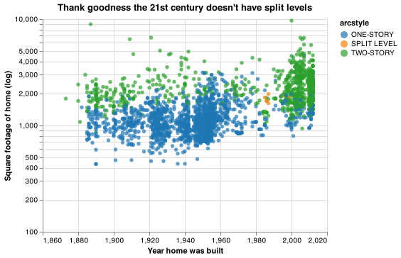
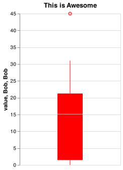

# Final Exam 

## Modules Import
``` python
import pandas as pd
import altair as alt
import numpy as np

from sklearn.model_selection import train_test_split
from sklearn import tree
from sklearn.ensemble import RandomForestClassifier
from sklearn import metrics
```

## Q1
``` python
#%%
url = 'https://github.com/byuidatascience/data4dwellings/raw/master/data-raw/dwellings_denver/dwellings_denver.csv'
dat_home = pd.read_csv(url).sample(n=4500, random_state=15)
#%%
dat2 = dat_home.filter(["arcstyle", "yrbuilt", "livearea"])
#%%
dat2.arcstyle.unique()
dat2 = dat2.query("arcstyle == ['ONE-STORY', 'SPLIT LEVEL', 'TWO-STORY']")
print(len(dat2))
#%%
q1_chart = alt.Chart(dat2).mark_circle().encode(
  x=alt.X("yrbuilt", 
          axis=alt.Axis(title='Year home was built'), 
          scale=alt.Scale(
                domain=[
                    1860,2020
                ]
            )),
  y=alt.Y("livearea", 
          axis=alt.Axis(title='Square footage of home (log)'),
          scale=alt.Scale(type="log")),
  color = alt.Color("arcstyle", scale=alt.Scale(scheme='category10'))
).properties(
    title={
      "text": ["Thank goodness the 21st century doesn't have split levels"]
    },
)
q1_chart
q1_chart.save('./img/q1_chart.png')
```


## Q2
``` python
bob = pd.Series(['N/A', 15, 22, 45, 31, -999, 21, 2, 0, 0, 0, 'broken'])
# %%
replaced_q2_dat = bob.replace(["N/A", -999, 'broken'], np.nan)
replaced_q2_dat.dropna(inplace = True)
replaced_q2_dat
# bob.replace('N/A', np.nan, inplace=True).replace('-999', np.nan)
# bob

# %%
def variance(data):
  # Number of observations
  n = len(data)
  # Mean of the data
  mean = sum(data) / n
  # Square deviations
  deviations = [(x - mean) ** 2 for x in data]
  # Variance
  variance = sum(deviations) / n
  return variance

st_dv = round(variance(replaced_q2_dat), 2)
st_dv
```

The standard deviation is **231.654**

## Q3
```python
bob
# From the function above, mean is 15.1
#%%
replaced_q3_dat = bob.replace(["N/A", -999, 'broken'], 15.1)
replaced_q3_dat
#%%
df = pd.DataFrame(np.array(replaced_q3_dat), columns=["value"])
df
# %%
q3_chart = alt.Chart(df).mark_boxplot(color="red", size=50, extent=1.2).encode(
  x=alt.X(axis=alt.Axis(title='This is Awesome')), 
  y=alt.Y("value", 
          axis=alt.Axis(title='Bob')),
).properties(
    title={
      "text": ["This is Awesome"]
    },
    width=200
)
q3_chart
```



## Q4
``` python
url = "http://byuistats.github.io/CSE250-Course/data/clean_starwars.csv"
q4_dat = pd.read_csv(url)
# %%
q4_dat.head()
q4_dat.columns
# %%
# Use test_size = .20 and random_state = 2022 in train_test_split()
# Use the RandomForestClassifier(random_state = 2022) method.

x = q4_dat.filter(["gender"])
x
x.replace("Male", 1, inplace=True)
x.replace("Female", 0, inplace=True)
#%%
y = q4_dat.filter(['rank__i__the_phantom_menace', 'rank__ii__attack_of_the_clones',
       'rank__iii__revenge_of_the_sith', 'rank__iv__a_new_hope',
       'rank__v_the_empire_strikes_back', 'rank__vi_return_of_the_jedi',
       'age_min', 'education', 'income_label', 'seen_any_Yes',
       'star_wars_fans_Yes', 'view__han_solo_Somewhat favorably',
       'view__han_solo_Somewhat unfavorably',
       'view__han_solo_Unfamiliar (N/A)', 'view__han_solo_Very favorably',
       'view__han_solo_Very unfavorably',
       'view__luke_skywalker_Somewhat favorably',
       'view__luke_skywalker_Somewhat unfavorably',
       'view__luke_skywalker_Unfamiliar (N/A)',
       'view__luke_skywalker_Very favorably'])
y

#%%
x_train, x_test, y_train, y_test = train_test_split(x, y, test_size = .20, random_state = 2022)

x_train.gender.unique()
#%%
x_test.gender.unique()
#%% 
# Error Happend Here :ValueError: multiclass-multioutput is not supported
# create the model
classifier = RandomForestClassifier(random_state = 2022)

# train the model
classifier.fit(x_train, y_train)

# make predictions
y_predictions = classifier.predict(x_test)

# test how accurate predictions are
metrics.accuracy_score(y_test, y_predictions)

#%% 
# Feature importance
classifier.feature_importances_

#%%
feature_df = pd.DataFrame({'features':x.columns, 'importance':classifier.feature_importances_})
feature_df
```
