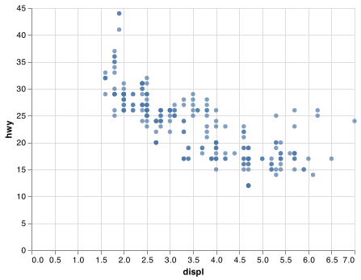

# Client Report - [Project 0]

**Course CSE 250**
Masahiro Takechi

## Elevator pitch

This is for reporting the completion of installing some packages of npm and pip3 which are necessary for comming projects. Also, I am going to explain exactly which packages I have installed.

### GRAND QUESTION 1

#### None: due to This is Project 0.

##### TECHNICAL DETAILS

**Packages**
pip3

- Python 3.10.4 64-bit
- numpy 1.20.3
- pandas 1.4.2
- xlrd 2.0.1
- matplotlib 3.5.1
- seaborn 0.11.2
- plotnine 0.8.0
- altair 4.2.0
- vega_datasets 0.9.0
- altair_saver 0.5.0
- statsmodels 0.12.0
- scikit-learn 0.24.2
- jupyter 1.0.0

**npm**

- node 16.14.2
- canvas 2.9.1
- vega-cli 5.22.1
- vega-lite5.2.0

After I was finished installing packages above, I fetched data from this url (https://github.com/byuidatascience/data4python4ds/raw/master/data-raw/mpg/mpg.csv). With pandas and altair, I plotted the data to a chart. The chart is below.


Here is the first five data from the dataset and the code to get the five data from the url above.

```python
print(mpg
    .head(5)
    .filter(["manufacturer", "model","year", "hwy"])
    .to_markdown(index=False))
```

| manufacturer | model | year | hwy |
| :----------- | :---- | ---: | --: |
| audi         | a4    | 1999 |  29 |
| audi         | a4    | 1999 |  29 |
| audi         | a4    | 2008 |  31 |
| audi         | a4    | 2008 |  30 |
| audi         | a4    | 1999 |  26 |
