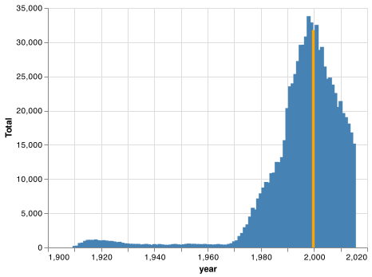
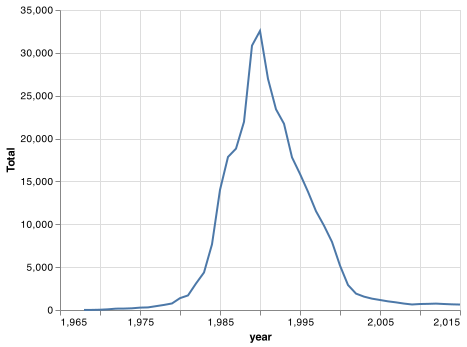
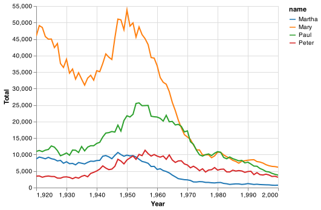
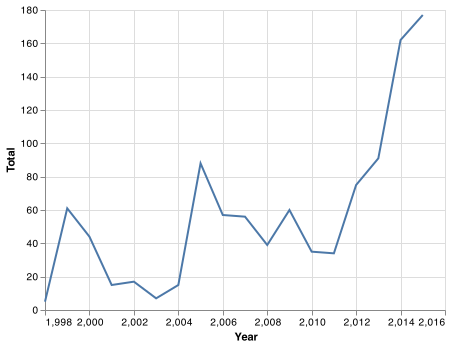
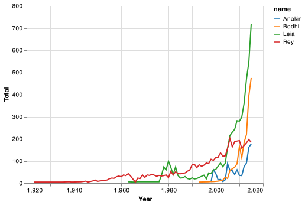

# Client Report - [What is in a name?]
__Course CSE 250__
Masahiro Takechi

## Elevator pitch
Hi, I'm Masahiro Takechi and a Computer Science student at Brigham Young University - Idaho, Rexburg. Over the last 2 weeks, I have been working on a research about popularity of names to know if they are popular or not. I have had 4 tasks to complete: popularity of my name, Brittany, 4 Christian names, and a name from a famous movie, which is Anakin in Star Wars.

### GRAND QUESTION 1
#### How does your name at your birth year compare to its use historically?
Because I got 0 output with my Japanese name, I used my best colleague's name, **Jacob**, for the Grand Question 1 with my birth year, **2000**. 
The number of Jacob in 2000 is **31774**. The year which recorded the highest number of the name is *1998* and a few years around 1998 have over 30,000 Jacobs. 
One more thing I would like to mention is that **the name, Jacob wasn't really used until 1970**. After the year, the number of Jacob increased rapidly until 1998 although the name hasn't been really common in the U.S. since 1998.
##### TECHNICAL DETAILS

```python 
# This is the dataset I used for this entire project. 
url = "https://github.com/byuidatascience/data4names/raw/master/data-raw/names_year/names_year.csv"
names = pd.read_csv(url)
```

```python
# Get the all years and corresponding total number of Jacob
allMyName= names.query("name == 'Jacob'")[["name", "year","Total"]]
allMyName
```
The output is the table below showing only the first and last three rows of 106 rows
| id      | name       | year | Total     |
|--------:|:----------:|:----:|:---------:|
| 173137  | Jacob      | 1910 | 225.0     |
| 173138  | Jacob      | 1911 | 270.0     |
| 173139  | Jacob      | 1912 | 655.0     |
| ...     | ...        | ...  | ...       |
| 173240  | Jacob      | 2013 | 18110.0   |
| 173241  | Jacob      | 2014 | 16812.0   |
| 173242  | Jacob      | 2015 | 15178.0   |


```python 
# Get the highest number of Jacob in the U.S. in a year and the year
myNameAtMyBirthYear = names.query("name == 'Jacob' & year == 2000 ")[["name", "year","Total"]]
myNameAtMyBirthYear
```
The output is the table below. 
| id      | name       | year | Total   |
|--------:|:----------:|:----:|:-------:|
| 173227  | Jacob      | 2000 | 31774.0 |


``` python
# With the "allMyName" dataset and code below, I plotted a simple bar chart shown under this code. 
chart = alt.Chart(allMyName).mark_bar().encode(
    x='year',
    y='Total',
    color=alt.condition(
        alt.datum.year == 2000,  # If the year is 1810 this test returns True,
        alt.value('orange'),     # which sets the bar orange.
        alt.value('steelblue')   # And if it's not true it sets the bar steelblue.
    )
)
chart
# chart.save('grand_q1_chart.png')
```
The output is the chart below. 


### GRAND QUESTION 2
#### If you talked to someone named Brittany on the phone, what is your guess of their age? What ages would you not guess?

Her age is likely in the range of 22 and 37. 
(2022 - 2000 = 22, 2022 - 1985 = 37)
Considering the chart below which shows the popularity of the name, Brittany, she was most likely born from 1985 to 2000. There are not so many Brittanies before 1985 and after 2000. 

##### TECHNICAL DETAILS

```python 
# Get the all years and corresponding total number of Brittany
brittany = names.query("name == 'Brittany'")[["name", "year","Total"]]
brittany
```
The output is the table below showing only the first and last three rows of 52 rows
| id      | name          | year | Total   |
|--------:|:-------------:|:----:|:-------:|
| 53205   | Brittany      | 1968 | 5.0     |
| 53206   | Brittany      | 1969 | 12.0    |
| 53207   | Brittany      | 1970 | 32.0    |
| ...     | ...           | ...  | ...     |
| 53250   | Brittany      | 2013 | 699.0   |
| 53251   | Brittany      | 2014 | 660.0   |
| 53252   | Brittany      | 2015 | 636.0   |

```python

# min 
print("MINIMUM usage of Brittany")
min_brittany_year = brittany.query(f"Total == " + str(brittany.Total.min())).year
min_brittany_ttl = brittany.query(f"Total == " + str(brittany.Total.min())).Total
print(min_brittany_year, min_brittany_ttl)

# max
print("\nMAXIMUM usage of Brittany")
print("Year: ", brittany.query(f"Total == " + str(brittany.Total.max())).year, "\nTotal: ", brittany.query(f"Total == " + str(brittany.Total.max())).Total)
```
This code above shows which age has the smallest (1968) and  the highest (1990) number of Brittanies. 

``` python
# With the "allMyName" dataset and code below, I plotted a simple bar chart shown under this code. 
brit_chart = alt.Chart(brittany).mark_line().encode(
    x='year',
    y='Total',
)
brit_chart
brit_chart.save('charts/grand_q2_chart.png')
# chart.save('grand_q1_chart.png')
```
The output is the chart below. 



### GRAND QUESTION 3
#### Mary, Martha, Peter, and Paul are all Christian names. From 1920 - 2000, compare the name usage of each of the four names.
I expected the names are still popular, but the result tells it's not true. 
The name, Mary, stands out since 1920 to 1970.Other three names, Martha, Peter, Paul, had been gradually used from 1920 to around 1950. After 1950-ish, all four name have been not used much and the number of the names keep decreasing since 1950-ish. 

##### TECHNICAL DETAILS

```python 
# Query data by the four names
chritianNames = names.query(
  "name == ['Mary', 'Martha', 'Peter', 'Paul'] & year >= 1920 & year <= 2000"
  )[["name", "year","Total"]]
chritianNames
```
The output is the table below showing only the first and last three rows of 324 rows
| id     | name   | year | Total  |
|---------:|:-------------:|:----:|:------:|
| 264124 | Martha | 1920 | 8705.0 |
| 264125 | Martha | 1921 | 9254.0 |
| 264126 | Martha | 1922 | 9018.0 |
| ...    | ...    | ...  | ...    |
| 303693 | Peter | 1998 | 3377.0 |
| 303694 | Peter | 1999 | 3430.0 |
| 303695 | Peter | 2000 | 3137.0 |

```python
all_chart = (alt.Chart(chritianNames)
    .mark_line()
    .encode(
        x = alt.X("year", axis=alt.Axis(title="Year")),
        y = alt.Y("Total", axis=alt.Axis(title="Total")),
        color = alt.Color("name", scale=alt.Scale(scheme='category10'))
    ).interactive()
)
all_chart
# all_chart.save('charts/grand_q3_chart.png')
```
The output is the chart below. 


### GRAND QUESTION 4
#### Think of a unique name from a famous movie. Plot that name and see how increases line up with the movie release.
According to the chart below, the name, Anakin from the movie Star Wars, got the most number of usage in the year 2015. Interstingly, the number of the name, Anakin, increased a lot every when a new movie of Star Wars is released. In the chart, you can see that on 1999, 2005, and 2015, the number of the name, Anakin, is the highest among a few years around the years.

##### TECHNICAL DETAILS

```python 
anakin = names.query(
  "name == 'Anakin'")[["name", "year","Total"]]
anakin
```
The output is the table below showing only the first and last three rows of 324 rows
| id    | name   | year | Total |
|------:|:------:|:----:|:-----:|
| 19325 | Anakin | 1998 | 5.0   |
| 19326 | Anakin | 1999 | 61.0  |
| 19327 | Anakin | 2000 | 44.0  |
| ...   | ...    | ...  | ...   |
| 19340 | Anakin | 2013 | 91.0  |
| 19341 | Anakin | 2014 | 162.0 |
| 19342 | Anakin | 2015 | 177.0 |

```python
anakin_chart = (alt.Chart(anakin)
    .mark_line()
    .encode(
        x = alt.X("year", axis=alt.Axis(title="Year")),
        y = alt.Y("Total", axis=alt.Axis(title="Total"))
    )
)

anakin_chart
anakin_chart.save('charts/grand_q4_chart.png')

```
The output is the chart below. 


#### Chart for Anakin and other 3 names in Star Wars
I was just interested in how other names in Star Wars have been used.
```python 
sw = names.query(
  "name == ['Anakin', 'Leia', 'Rey', 'Bodhi']")[["name", "year","Total"]]
sw
```

```python
starWarsChart = (alt.Chart(sw)
    .mark_line()
    .encode(
        x = alt.X("year", axis=alt.Axis(title="Year")),
        y = alt.Y("Total", axis=alt.Axis(title="Total")),
        color = alt.Color("name", scale=alt.Scale(scheme='category10'))
    ).interactive()
)
starWarsChart
starWarsChart.save('charts/star_wars_names_chart.png')
```
