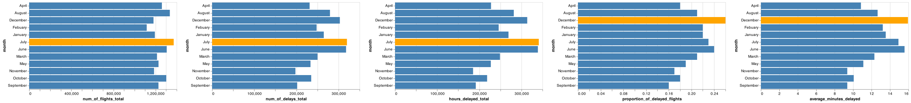

# Client Report - [Are we missing JSON on our flight?]
__Course CSE 250__
Masahiro Takechi

## Elevator pitch
------- think about it later

### GRAND QUESTION 1
#### Which airport has the worst delays? How did you choose to define “worst”? As part of your answer include a table that lists the total number of flights, total number of delayed flights, proportion of delayed flights, and average delay time in hours, for each airport.

Considering the table and the chart below, the worst airport among the 7 is SFO in my opinion. It seems like ATL or ORD is the worst, but the columns we need to look at are "average_delayed_hour" and "proportion_of_delayed_flights". ATL and ORD are a very big internatonal airport, so they have more number of flights and delays. However, SFO records 26.1% of delayed flights out of all flights and also .271 hour for having customers wait. The values are both worst out of the seven airports, so I believe SFO is the worst in terms of flights that possibly delay. 

##### TECHNICAL DETAILS

```python 
# import python modules
import pandas as pd
import altair as alt
import numpy as np
# %%
url = "https://github.com/byuidatascience/data4missing/raw/master/data-raw/flights_missing/flights_missing.json"
flights = pd.read_json(url)

# Drop n/a from the dataframe, "flights"
drpFli = flights.dropna()

# Then, add rows in some columns depending on which airport the data belongs to
group = flights.groupby("airport_code").sum()[["num_of_flights_total", "num_of_delays_total", "minutes_delayed_total"]].reset_index()

# For proportion_of_delayed_flights
data = {'airport_code':['ATL', 'DEN', 'IAD', 'ORD', 'SAN', 'SFO', 'SLC'],
        'PropOfDelay':[atlPropOfDelay, denPropOfDelay, iadPropOfDelay, ordPropOfDelay, sanPropOfDelay, sfoPropOfDelay, slcPropOfDelay]}
# Create DataFrame
dfPropOfDelay = pd.DataFrame(data)

# Combine dfPropOfDelay with group
list(round(dfPropOfDelay.PropOfDelay, 2))
group.assign(proportion_of_delayed_flights = dfPropOfDelay["PropOfDelay"], inplace=True)
group
```

The output is the table below.
| airport_code   |   num_of_flights_total |   num_of_delays_total |   average_delayed_hour |   proportion_of_delayed_flights |
|:---------------|-----------------------:|----------------------:|-------------------------:|--------------------------------:|
| ATL            |                4430047 |                902443 |                    0.203 |                           20.37 |
| DEN            |                2513974 |                468519 |                    0.167 |                           18.64 |
| IAD            |                 851571 |                168467 |                    0.201 |                           20.37 |
| ORD            |                3597588 |                830825 |                    0.261 |                           23.09 |
| SAN            |                 917862 |                175132 |                    0.15  |                           19.08 |
| SFO            |                1630945 |                425604 |                    0.271 |                           26.1  |
| SLC            |                1403384 |                205160 |                    0.12  |                           14.62 |

``` python 
# Create a table for each column with y which is all airport_code
# Like below
chart_proportion_of_delayed_flights = alt.Chart(group).mark_bar().encode(
    x="proportion_of_delayed_flights",
    y="airport_code",
    color=alt.condition(
        alt.datum.proportion_of_delayed_flights == group.proportion_of_delayed_flights.max(),
        alt.value('orange'),
        alt.value('steelblue')
    )
)
chart_proportion_of_delayed_flights

# ... other three columns too

# After successfully ploting four charts in total, combine all and save the chart containing all four charts
all_chart = chart_num_of_flights_total | chart_num_of_delays_total | chart_proportion_of_delayed_flights | chart_delayed_total_in_hours 
all_chart.save("./imgs/q1.png")
```
The output is the chart below. 


### GRAND QUESTION 2
#### What is the worst month to fly if you want to avoid delays? Include one chart to help support your answer, with the x-axis ordered by month. You also need to explain and justify how you chose to handle the missing Month data.

The worst month to fly in terms of delay is December. December has the worst percentage of delayed flights so it's more likely to delay in December. July and June have the largest number of delayed flights and the longest hours delayed in total, but that is because July and June are the busiest season of travel and flights. However, it's just a small difference between December and June(& July) on average minutes delayed. 

##### TECHNICAL DETAILS

```python 
# first drop all rows whose month is "n/a"
indexNames = flights[ flights['month'] == "n/a" ].index
flights.drop(indexNames, inplace=True)

# group by month 
monthFlight = flights.groupby('month')["month", "num_of_flights_total", "num_of_delays_total", "minutes_delayed_total"].sum().reset_index()
monthFlight

# Add a column of a proportion of delayed flights
monthFlight = monthFlight.assign(proportion_of_delayed_flights = round(monthFlight.num_of_delays_total / monthFlight.num_of_flights_total, 2))

# Add a column of an average of delayed minutes
monthFlight = monthFlight.assign(average_minutes_delayed = round(monthFlight.minutes_delayed_total / monthFlight.num_of_flights_total, 2))

``` 
monthFlight should look like the table below. 
|    | month     |   num_of_flights_total |   num_of_delays_total |   minutes_delayed_total |   proportion_of_delayed_flights |   average_delayed_minutes |
|---:|:----------|-----------------------:|----------------------:|------------------------:|--------------------------------:|--------------------------:|
|  0 | April     |                1259723 |                231408 |                13667654 |                            0.18 |                     10.85 |
|  1 | August    |                1335158 |                279699 |                16906565 |                            0.21 |                     12.66 |
|  2 | December  |                1180278 |                303133 |                18821267 |                            0.26 |                     15.95 |
|  3 | Febuary   |                1115814 |                248033 |                14753955 |                            0.22 |                     13.22 |
|  4 | January   |                1193018 |                265001 |                16152667 |                            0.22 |                     13.54 |
|  5 | July      |                1371741 |                319960 |                20465456 |                            0.23 |                     14.92 |
|  6 | June      |                1305663 |                317895 |                20338750 |                            0.24 |                     15.58 |
|  7 | March     |                1213370 |                250142 |                14942262 |                            0.21 |                     12.31 |
|  8 | May       |                1227795 |                233494 |                13637705 |                            0.19 |                     11.11 |
|  9 | November  |                1185434 |                197768 |                11112089 |                            0.17 |                      9.37 |
| 10 | October   |                1301612 |                235166 |                13109792 |                            0.18 |                     10.07 |
| 11 | September |                1227208 |                201905 |                11495811 |                            0.16 |                      9.37 |
``` python
# plot each column with x axis of month 
# One example code
month_num_of_flights_total = alt.Chart(monthFlight).mark_bar().encode(
    x="num_of_flights_total",
    y="month",
    color=alt.condition(
        alt.datum.num_of_flights_total == monthFlight.num_of_flights_total.max(),
        alt.value('orange'),
        alt.value('steelblue')
    )
)
month_num_of_flights_total

# Combine all five 
month_num_of_flights_total | month_num_of_delays_total | month_hours_delayed_total | month_proportion_of_delayed_flights

```
The output is the chart below. 



### GRAND QUESTION 3
#### According to the BTS website the Weather category only accounts for severe weather delays. Other “mild” weather delays are included as part of the NAS category and the Late-Arriving Aircraft category. Calculate the total number of flights delayed by weather (either severe or mild) using these two rules:
##### a. 30% of all delayed flights in the Late-Arriving category are due to weather.
##### b. From April to August, 40% of delayed flights in the NAS category are due to weather. The rest of the months, the proportion rises to 65%.

I expected the names are still popular, but the result tells it's not true. 
The name, Mary, stands out since 1920 to 1970.Other three names, Martha, Peter, Paul, had been gradually used from 1920 to around 1950. After 1950-ish, all four name have been not used much and the number of the names keep decreasing since 1950-ish. As for missing month which displays "n/a", I deleted all from the dataframe of flights because I didn't know which month those are exactly even if I could guess. 

##### TECHNICAL DETAILS

```python 
# Query data by the four names
chritianNames = names.query(
  "name == ['Mary', 'Martha', 'Peter', 'Paul'] & year >= 1920 & year <= 2000"
  )[["name", "year","Total"]]
chritianNames
```
The output is the table below showing only the first and last three rows of 324 rows
| id     | name   | year | Total  |
|---------:|:-------------:|:----:|:------:|
| 264124 | Martha | 1920 | 8705.0 |
| 264125 | Martha | 1921 | 9254.0 |
| 264126 | Martha | 1922 | 9018.0 |
| ...    | ...    | ...  | ...    |
| 303693 | Peter | 1998 | 3377.0 |
| 303694 | Peter | 1999 | 3430.0 |
| 303695 | Peter | 2000 | 3137.0 |

```python
all_chart = (alt.Chart(chritianNames)
    .mark_line()
    .encode(
        x = alt.X("year", axis=alt.Axis(title="Year")),
        y = alt.Y("Total", axis=alt.Axis(title="Total")),
        color = alt.Color("name", scale=alt.Scale(scheme='category10'))
    ).interactive()
)
all_chart
# all_chart.save('charts/grand_q3_chart.png')
```
The output is the chart below. 


### GRAND QUESTION 4
#### Create a barplot showing the proportion of all flights that are delayed by weather at each airport. What do you learn from this graph (Careful to handle the missing Late Aircraft data correctly)?
According to the chart below, the name, Anakin from the movie Star Wars, got the most number of usage in the year 2015. Interstingly, the number of the name, Anakin, increased a lot every when a new movie of Star Wars is released. In the chart, you can see that on 1999, 2005, and 2015, the number of the name, Anakin, is the highest among a few years around the years.

##### TECHNICAL DETAILS

```python 
anakin = names.query(
  "name == 'Anakin'")[["name", "year","Total"]]
anakin
```
The output is the table below showing only the first and last three rows of 324 rows
| id    | name   | year | Total |
|------:|:------:|:----:|:-----:|
| 19325 | Anakin | 1998 | 5.0   |
| 19326 | Anakin | 1999 | 61.0  |
| 19327 | Anakin | 2000 | 44.0  |
| ...   | ...    | ...  | ...   |
| 19340 | Anakin | 2013 | 91.0  |
| 19341 | Anakin | 2014 | 162.0 |
| 19342 | Anakin | 2015 | 177.0 |

```python
anakin_chart = (alt.Chart(anakin)
    .mark_line()
    .encode(
        x = alt.X("year", axis=alt.Axis(title="Year")),
        y = alt.Y("Total", axis=alt.Axis(title="Total"))
    )
)

anakin_chart
anakin_chart.save('charts/grand_q4_chart.png')

```
The output is the chart below. 


#### Chart for Anakin and other 3 names in Star Wars
I was just interested in how other names in Star Wars have been used.
```python 
sw = names.query(
  "name == ['Anakin', 'Leia', 'Rey', 'Bodhi']")[["name", "year","Total"]]
sw
```

```python
starWarsChart = (alt.Chart(sw)
    .mark_line()
    .encode(
        x = alt.X("year", axis=alt.Axis(title="Year")),
        y = alt.Y("Total", axis=alt.Axis(title="Total")),
        color = alt.Color("name", scale=alt.Scale(scheme='category10'))
    ).interactive()
)
starWarsChart
starWarsChart.save('charts/star_wars_names_chart.png')
```


### GRAND QUESTION 3
#### Fix all of the varied NA types in the data to be consistent and save the file back out in the same format that was provided (this file shouldn’t have the missing values replaced with a value). Include one record example from your exported JSON file that has a missing value (No imputation in this file).

I expected the names are still popular, but the result tells it's not true. 
The name, Mary, stands out since 1920 to 1970.Other three names, Martha, Peter, Paul, had been gradually used from 1920 to around 1950. After 1950-ish, all four name have been not used much and the number of the names keep decreasing since 1950-ish. 

##### TECHNICAL DETAILS

```python 
# Query data by the four names
chritianNames = names.query(
  "name == ['Mary', 'Martha', 'Peter', 'Paul'] & year >= 1920 & year <= 2000"
  )[["name", "year","Total"]]
chritianNames
```
The output is the table below showing only the first and last three rows of 324 rows
| id     | name   | year | Total  |
|---------:|:-------------:|:----:|:------:|
| 264124 | Martha | 1920 | 8705.0 |
| 264125 | Martha | 1921 | 9254.0 |
| 264126 | Martha | 1922 | 9018.0 |
| ...    | ...    | ...  | ...    |
| 303693 | Peter | 1998 | 3377.0 |
| 303694 | Peter | 1999 | 3430.0 |
| 303695 | Peter | 2000 | 3137.0 |

```python
all_chart = (alt.Chart(chritianNames)
    .mark_line()
    .encode(
        x = alt.X("year", axis=alt.Axis(title="Year")),
        y = alt.Y("Total", axis=alt.Axis(title="Total")),
        color = alt.Color("name", scale=alt.Scale(scheme='category10'))
    ).interactive()
)
all_chart
# all_chart.save('charts/grand_q3_chart.png')
```
The output is the chart below. 


