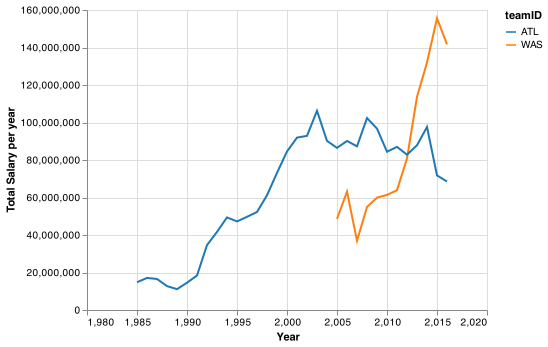

This file is the same as submit.md
# Client Report - [Finding relationships in baseball]
__Course CSE 250__
Masahiro Takechi

## Elevator pitch

Hi, I studied a MLB baseball data. I could see which players attended BYU-Idaho, who's batting average in which year is the highest in the whole MLB history, and comparison of two teams in terms of total salary of all players in the team. 

### GRAND QUESTION 1
#### Write an SQL query to create a new dataframe about baseball players who attended BYU-Idaho. The new table should contain five columns: playerID, schoolID, salary, and the yearID/teamID associated with each salary. Order the table by salary (highest to lowest) and print out the table in your report.

#### ANALYSIS
Two of all the players graduated from BYU Idaho.

#### TECHNICAL DETAILS

```python 
q1 = pd.read_sql_query("""
  SELECT cp.playerid, s.yearid, s.teamid, s.salary
  FROM CollegePlaying AS cp
    JOIN Salaries AS s on cp.playerid = s.playerid
  where cp.playerid = 'catetr01' or cp.playerid =  'lindsma01' or cp.playerid = 'stephga01'
  GROUP BY s.yearid
  ORDER BY s.salary DESC
""", con)
q1
```

The output is the chart below. 

| playerID   | schoolID   |   yearID | teamID   |   k_salary |
|:-----------|:-----------|---------:|:---------|-----------:|
| lindsma01  | idbyuid    |     2014 | CHA      |       4000 |
| lindsma01  | idbyuid    |     2012 | BAL      |       3600 |
| lindsma01  | idbyuid    |     2011 | COL      |       2800 |
| lindsma01  | idbyuid    |     2013 | CHA      |       2300 |
| lindsma01  | idbyuid    |     2010 | HOU      |       1625 |
| stephga01  | idbyuid    |     2001 | SLN      |       1025 |
| stephga01  | idbyuid    |     2002 | SLN      |        900 |
| stephga01  | idbyuid    |     2003 | SLN      |        800 |
| stephga01  | idbyuid    |     2000 | SLN      |        550 |
| lindsma01  | idbyuid    |     2009 | FLO      |        410 |
| lindsma01  | idbyuid    |     2008 | FLO      |        395 |
| lindsma01  | idbyuid    |     2007 | FLO      |        380 |
| stephga01  | idbyuid    |     1999 | SLN      |        215 |
| stephga01  | idbyuid    |     1998 | PHI      |        185 |
| stephga01  | idbyuid    |     1997 | PHI      |        150 |

### GRAND QUESTION 2
#### This three-part question requires you to calculate batting average (number of hits divided by the number of at-bats)
##### a. Write an SQL query that provides playerID, yearID, and batting average for players with at least 1 at bat that year. Sort the table from highest batting average to lowest, and then by playerid alphabetically. Show the top 5 results in your report.
##### b. Use the same query as above, but only include players with at least 10 at bats that year. Print the top 5 results.
##### c. Now calculate the batting average for players over their entire careers (all years combined). Only include players with at least 100 at bats, and print the top 5 results.

##### Analysis
For c, I can see a batting average of Ty Cobb in 1905 is the highest in the whole history of MLB. 

##### TECHNICAL DETAILS
a)
| playerID   |   yearID |   AB |   H |   Average_Hits |
|:-----------|---------:|-----:|----:|---------------:|
| aberal01   |     1957 |    1 |   1 |           1000 |
| abernte02  |     1960 |    1 |   1 |           1000 |
| abramge01  |     1923 |    1 |   1 |           1000 |
| acklefr01  |     1964 |    1 |   1 |           1000 |
| alanirj01  |     2019 |    1 |   1 |           1000 |

b) 
| playerID   |   yearID |   AB |   H |   Average_Hits |
|:-----------|---------:|-----:|----:|---------------:|
| nymanny01  |     1974 |   14 |   9 |            642 |
| carsoma01  |     2013 |   11 |   7 |            636 |
| altizda01  |     1910 |   10 |   6 |            600 |
| johnsde01  |     1975 |   10 |   6 |            600 |
| silvech01  |     1948 |   14 |   8 |            571 |

c)
| playerID   |   yearID |   Carrer_At_Bats |   Career_Hits |   Average_Hits |
|:-----------|---------:|-----------------:|--------------:|---------------:|
| cobbty01   |     1905 |            11436 |          4189 |            366 |
| barnero01  |     1871 |             2391 |           860 |            359 |
| hornsro01  |     1915 |             8173 |          2930 |            358 |
| jacksjo01  |     1908 |             4981 |          1772 |            355 |
| meyerle01  |     1871 |             1443 |           513 |            355 |


### GRAND QUESTION 3
#### Pick any two baseball teams and compare them using a metric of your choice (average salary, home runs, number of wins, etc). Write an SQL query to get the data you need, then make a graph in Altair to visualize the comparison.

##### Anylysis
I compared annual salaries of ATL, Braves, and WAS, Natonals. I don't know why I didn't get data before 2005. With data I got from the dataframe, Nationals pay for the players more that Braves does recently. 


##### TECHNICAL DETAILS

```python 
was_salary = pd.read_sql_query("""
  from teamID, sum(salary) as sum_salary, yearID
  where teamID = 'WAS'
  group by yearID
""", con)
was_salary

atl_salary = pd.read_sql_query("""
  select teamID, sum(salary) as sum_salary, yearID
  from Salaries
  where teamID = 'ATL'
  group by yearID
""", con)
atl_salary

```



## Appendix 


### Q1
``` python
q1 = pd.read_sql_query("""
  SELECT cp.playerid, cp.schoolid, s.yearid, s.teamid, (s.salary/1000) AS k_salary
  FROM CollegePlaying AS cp
    JOIN Salaries AS s on cp.playerid = s.playerid
  where cp.playerid = 'catetr01' or cp.playerid =  'lindsma01' or cp.playerid = 'stephga01'
  GROUP BY s.yearid
  ORDER BY s.salary DESC
""", con)
q1
```

### Q2
```python
q2a = pd.read_sql_query("""
  select playerID, yearID, AB, H, H*1000 / AB AS Average_Hits
  from Batting
  where AB >= 1
  order by Average_Hits desc, playerID 
  limit 5
""", con)
q2a

q2b = pd.read_sql_query("""
  select playerID, yearID, AB, H, (H * 1000 / AB) AS Average_Hits
  from Batting
  where AB >= 10
  order by Average_Hits desc, playerID 
  limit 5
""", con)
q2b

q2c = pd.read_sql_query("""
  select playerID, SUM(AB) AS Carrer_At_Bats, SUM(H) AS Career_Hits, SUM(H)*1000 / SUM(AB) AS Average_Hits
  from Batting
  group by playerID
  having Carrer_At_Bats >= 100
  order by Average_Hits desc, playerID 
""", con)
q2c
```

### Q3
```python
was_salary = pd.read_sql_query("""
  select teamID, sum(salary) as sum_salary, yearID
  from Salaries
  where teamID = 'WAS'
  group by yearID
""", con)
was_salary

# %%
atl_salary = pd.read_sql_query("""
  select teamID, sum(salary) as sum_salary, yearID
  from Salaries
  where teamID = 'ATL'
  group by yearID
""", con)
atl_salary
#%%

was = alt.Chart(was_salary).mark_line().encode(
    x=alt.X("yearID"),
    y=alt.Y("sum_salary"),
            color = alt.Color("teamID", scale=alt.Scale(scheme='category10')
    ),
).interactive()
was
# %%
atl = alt.Chart(atl_salary).mark_line().encode(
    x=alt.X("yearID", title = 'Year'),
    y=alt.Y("sum_salary", title = 'Total Salary per year'),
    color = alt.Color("teamID", scale=alt.Scale(scheme='category10')
    ),
).interactive()
atl
# %%
was_and_atl = was + atl
was_and_atl
was_and_atl.save("./was_atl_salary.png")
```


