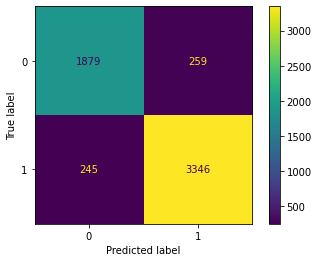

# Client Report - [Can you predict that?]
__Course CSE 250__
Masahiro Takechi

## Elevator pitch
To distinguish if a house is built before 1980 or after. Data I got had more than 20,000 rows, so I didn't want to look up each row. I mainly used a python module called "scikit" to let machine to distinguish which is which. It's basically machine learning and accuracy never became 100%, but at least more than 90%, so it's pretty accurate. Here is the step I made to get the accuacy. 

### GRAND QUESTION 1
#### Create 2-3 charts that evaluate potential relationships between the house variables and the variable before1980 Explain what you learn from the charts that could help a machine learning algorithm.

#### ANALYSIS
I made some charts to see the relationship between variables(finbsmnt and basement) (livearea and basement) and before1980. Some of the charts didn't have a good 45% line but those variables above had. 

#### TECHNICAL DETAILS
```python 
#%%
# Chart 1 for GQ1
chart = sns.lmplot(data=h_subset, x="finbsmnt", y="basement", col="before1980", hue="before1980")
chart

#%%
# Chart 2 for GQ1
sns.lmplot(data=h_subset, x="livearea", y="basement", col="before1980", hue="before1980")
```

### GRAND QUESTION 2
#### Build a classification model labeling houses as being built “before 1980” or “during or after 1980”. Your goal is to reach 90% accuracy. Explain your final model choice (algorithm, tuning parameters, etc) and describe what other models you tried.

##### Analysis
Accuracy with my model was 0.9120265316809216, so about 91%. 
I tried so many combinations of columns in ml dataframe to get accuracy of more than 90%. What i tried was mainly to change the number of columns or samples. First, I used all columns, but ["parcel", "yrbuilt", "before1980"] and checked each column's importance. Then, I re-created a dataframe with 10 to 15 columns whose importance was higher than other columns. 
##### TECHNICAL DETAILS
```python

x7 = ml.filter(["arcstyle_ONE-STORY", "gartype_Att", "quality_C", "livearea", "basement", "stories", "tasp", "netprice", "sprice", "abstrprd", "numbaths", "status_V", "numbdrm"])
y7 = ml["before1980"]

x_train, x_test, y_train, y_test = train_test_split(
  x7,
  y7,
  test_size = .25, 
  random_state = 10
)
```


### GRAND QUESTION 3
#### Justify your classification model by discussing the most important features selected by your model. This discussion should include a chart and a description of the features.

##### Anylysis
In my model, the 3 highest features are, from highest, "livearea", "arcstyle_ONE-STORY", "gartype_Att". 

| features           |   importance |
|:-------------------|-------------:|
| status_V           |    0.0257227 |
| numbdrm            |    0.0352429 |
| abstrprd           |    0.0559222 |
| quality_C          |    0.0684837 |
| basement           |    0.0728315 |
| sprice             |    0.0734354 |
| netprice           |    0.0745685 |
| tasp               |    0.0806549 |
| numbaths           |    0.0823371 |
| stories            |    0.086096  |
| gartype_Att        |    0.0888687 |
| arcstyle_ONE-STORY |    0.11373   |
| livearea           |    0.142107  |
<!-- After submission, my teacher said that only this table itself doesn't mean anything, so I needed to create a visualization graph to see easily which features have greater values -->
##### TECHNICAL DETAILS

```python 
feature_df = pd.DataFrame({'features':x7.columns, 'importance':classifier.feature_importances_})
feature_df.sort_values(by="importance", inplace=True)
feature_df
```


### GRAND QUESTION 4
#### Describe the quality of your classification model using 2-3 different evaluation metrics. You also need to explain how to interpret each of the evaluation metrics you use.

##### Anylysis
Two metrics I used to evaluate my classification model are to check the accuracy score and confusion matrics. I got 91.2% as above, and east-to-read confusioin matrics. 
##### TECHNICAL DETAILS

```python 
# Accuracy
print("Accuracy:", metrics.accuracy_score(y_test, y_predicted))
# confusion matrix
metrics.plot_confusion_matrix(classifier, x_test, y_test)
```

(1879+3346) / (1879+259+245+3346) = .0912

## Appendix 

### Q1
``` python

```

### Q2
```python
#%%
# Create a decision tree
classifier= RandomForestClassifier()
# classifier= DecisionTreeClassifier()

# Fit the decision tree
classifier.fit(x_train, y_train)

# Test the decision tree (make predictions)
y_predicted = classifier.predict(x_test)

# Evaluate the decision tree
print("Accuracy:", metrics.accuracy_score(y_test, y_predicted))


```

### Q3
```python

```

### Q4
```python

```


