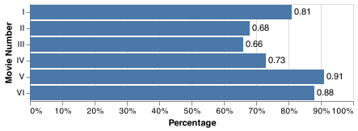

# Client Report - [The war with Star Wars]

**Course CSE 250**
Masahiro Takechi

## Elevator pitch

To distinguish if a house is built before 1980 or after. Data I got had more than 20,000 rows, so I didn't want to look up each row. I mainly used a python module called "scikit" to let machine to distinguish which is which. It's basically machine learning and accuracy never became 100%, but at least more than 90%, so it's pretty accurate. Here is the step I made to get the accuacy.

### GRAND QUESTION 1

#### Shorten the column names and clean them up for easier use with pandas.

#### ANALYSIS

I first needed to find which column names were a wordy, useless name. While some columns were unnamed, some other column names were a sentence-like name, so I had to change those into a short and clear name.

#### TECHNICAL DETAILS

```python
# %%
dat.rename(columns = {
  'Have you seen any of the 6 films in the Star Wars franchise?': 'haveSeenAny',
  'Do you consider yourself to be a fan of the Star Wars film franchise?': 'fan',
  'Which of the following Star Wars films have you seen? Please select all that apply.': 'haveWatchedOne',
  'Unnamed: 4': 'haveWatchedTw',
  'Unnamed: 5': 'haveWatchedTh',
  'Unnamed: 6': 'haveWatchedFr',
  'Unnamed: 7': 'haveWatchedFv',
  'Unnamed: 8': 'haveWatchedSx',
  'Please rank the Star Wars films in order of preference with 1 being your favorite film in the franchise and 6 being your least favorite film.': 'epi1PhantomMenace',
  'Unnamed: 10': 'epi2AttackClones',
  'Unnamed: 11': 'epi3RevengeSith',
  'Unnamed: 12': 'epi4NewHope',
  'Unnamed: 13': 'epi5EmpireStrikesBack',
  'Unnamed: 14': 'epi6ReturnJedi',
  'Please state whether you view the following characters favorably, unfavorably, or are unfamiliar with him/her.': 'likeHan',
  'Unnamed: 16': 'likeLuke',
  'Unnamed: 17': 'likeLeia',
  'Unnamed: 18': 'likeAnakin',
  'Unnamed: 19': 'likeObi',
  'Unnamed: 20': 'likePalpatine',
  'Unnamed: 21': 'likeDarth',
  'Unnamed: 22': 'likeLando',
  'Unnamed: 23': 'likeBoba',
  'Unnamed: 24': 'likeC3P0',
  'Unnamed: 25': 'likeR2D2',
  'Unnamed: 26': 'likeJar',
  'Unnamed: 27': 'likePadme',
  'Unnamed: 28': 'likeYoda',
  'Which character shot first?': 'shotFirst',
  'Are you familiar with the Expanded Universe?': 'FamiliarExpdUniv',
  'Do you consider yourself to be a fan of the Expanded Universe?ξ': 'fanExpdUniv',
  'Do you consider yourself to be a fan of the Star Trek franchise?': 'fanStarTrek',
}, inplace = True)
dat
```

I could change the inconvenient columns, and some examples are 
1. 'Please state whether you view the following characters favorably, unfavorably, or are unfamiliar with him/her.' to 'likeHan',
2. 'Unnamed: 16' to 'likeLuke',
3. 'Unnamed: 17' to 'likeLeia',

### GRAND QUESTION 2

#### Filter the dataset to those that have seen at least one film.

##### Analysis
When I run this code ```dat.haveWatchedOne.unique()```, I only got two values in the array. One is the title of the first Star Wars movie, and the other is NaN. 
##### TECHNICAL DETAILS

```python

dat.haveWatchedOne.unique()
# array(['Star Wars: Episode I  The Phantom Menace', nan], dtype=object)

print(f"before === \nthe number of rows: {len(dat)}\n==========")
# the number of rows: 1187

onlyWatched = dat.haveWatchedOne.dropna()
print(f"after === \nthe number of rows: {onlyWatched.count()}\n=========")
# the number of rows: 674
```
| haveWatchedOne                           |
|:-----------------------------------------|
| Star Wars: Episode I  The Phantom Menace |
| Star Wars: Episode I  The Phantom Menace |
| Star Wars: Episode I  The Phantom Menace |
| Star Wars: Episode I  The Phantom Menace |
| Star Wars: Episode I  The Phantom Menace |
| Star Wars: Episode I  The Phantom Menace |
| Star Wars: Episode I  The Phantom Menace |
| Star Wars: Episode I  The Phantom Menace |
| Star Wars: Episode I  The Phantom Menace |
| Star Wars: Episode I  The Phantom Menace |

### GRAND QUESTION 3

#### Please validate that the data provided on GitHub lines up with the article by recreating 2 of their visuals and calculating 2 summaries that they report in the article.

##### Anylysis
This question was kind of tricky because there were some people who answered 'Yes' to a question, "Have you watched at least one of the 6 Star Wars movies', and answered all 6 NaN to questions asking for each episode. 
As a Result, three of the four information they reported in the article (2 visuals and 2 summaries) were correct. 


|       No |      Yes | ←Have Seen One, Gen↓ |
|---------:|---------:|----:|
| 0.276867 | 0.723133 | M   |
| 0.148893 | 0.851107 | F   |
| 0.216061 | 0.783939 | Ttl |


For this one, I didn't get the same information they reported in the article. I tried both of dropping NaN values and including them. 
|   Female |     Male | ←Gen, Fan of Star Trek↓ |
|---------:|---------:|------------------------:|
| 0.529412 | 0.470588 | No                      |
| 0.440389 | 0.559611 | Yes                     |
| 0.484737 | 0.515263 | Ttl                     |

##### TECHNICAL DETAILS

```python
# Sum1
pd.crosstab(dat.Gender, dat.haveSeenAny, normalize="index", margins=True).to_markdown(index=False)

# Sum2
q3_2 = q3.dropna(subset=["Gender", "fanStarTrek"])
print(len(q3_2))
pd.crosstab(q3_2.fanStarTrek, q3_2.Gender, normalize="index", margins=True).to_markdown(index=False)
```

### GRAND QUESTION 4
#### Clean and format the data so that it can be used in a machine learning model. Please achieve the following requests and provide examples of the table with a short description the changes made in your report.

##### Create an additional column that converts the age ranges to a number and drop the age range categorical column.
min_age: ["18": "1", '30': "2", "45": "3", "> 60": "4", np.nan: "0"]
max_age: ["29": "1", '44': "2", "60": "3", "None": "4", np.nan: "0"]
|   min_age |   max_age |
|----------:|----------:|
|         1 |         1 |
|         1 |         1 |
|         1 |         1 |
|         1 |         1 |
|         1 |         1 |

##### Create an additional column that converts the school groupings to a number and drop the school categorical column.
np.nan: "0", "Less than high school degree": "1", 'High school degree': "2", 'Some college or Associate degree': "3", "Bachelor degree": "4", "Graduate degree": "5"
|   Education |
|------------:|
|           2 |
|           2 |
|           3 |
|           3 |
|           4 |
|           2 |
|           2 |
|           3 |
|           3 |
|           4 |
##### Create an additional column that converts the income ranges to a number and drop the income range categorical column.
np.nan: "0", "$0 - $24,999": "1", '$25,000 - $49,999': "2",  '$50,000 - $99,999': "3",  "$100,000 - $149,999": "4",  "$150,000+": "5"
I dropped Age column and added min_age and max_age columns
|   Household Income |
|-------------------:|
|                  0 |
|                  1 |
|                  4 |
|                  4 |
|                  2 |
|                  0 |
|                  0 |
|                  1 |
|                  2 |
|                  2 |
##### Create your target (also known as label) column based on the new income range column.
If Household Income is 4 or 5, place 1 as a value for is_rich column
|   Household Income |   is_rich |
|-------------------:|----------:|
|                  0 |         0 |
|                  1 |         0 |
|                  4 |         1 |
|                  4 |         1 |
|                  2 |         0 |
|                  0 |         0 |
|                  0 |         0 |
|                  1 |         0 |
|                  2 |         0 |
|                  2 |         0 |
##### One-hot encode all remaining categorical columns.
I could replace all values with a number in the dataframe. NaN value to -1 and others are from 1 to 6. 

### GRAND QUESTION 5

#### Build a machine learning model that predicts whether a person makes more than $50k.

##### Anylysis
I reused code Written in project 4 to create a classification model and an accuracy. Unlikely the data used in the last project, I didn't get a high accuracy this time. The highest was around 30%.

Here is the chart of feature importances I used to get an accuracy. 

##### TECHNICAL DETAILS

<!-- ```python

``` -->

## Appendix

### Q1

```python

```

### Q2

```python

```

### Q3

```python

```

### Q4
#### 1
```python
# aaaaaaaaa
two_columns = day3_at_least_watched_one["Age"].str.split("-", expand = True).rename(columns = {0: 'min_age', 1: 'max_age'})
separatedAge = pd.concat([day3_at_least_watched_one, two_columns], axis=1)
separatedAge.drop(columns="Age")

# replace values in min_age and max_age columns. 
(q3
  .min_age.replace({"18": "1", '30': "2", "45": "3", "> 60": "4", np.nan: "0"}, inplace=True)
  )

(q3
  .max_age.replace({"29": "1", '44': "2", "60": "3", "None": "4", np.nan: "0"}, inplace=True)
  )

# bbbbbbbbb
(q3
  .Education.replace(
    {
      np.nan: "0",
      "Less than high school degree": "1",
      'High school degree': "2", 
      'Some college or Associate degree': "3", 
      "Bachelor degree": "4", 
      "Graduate degree": "5", 
    }, inplace=True)
  )

# cccccccccc
(q3
  ["Household Income"].replace(
    {
      np.nan: "0",
      "$0 - $24,999": "1",
      '$25,000 - $49,999': "2", 
      '$50,000 - $99,999': "3", 
      "$100,000 - $149,999": "4", 
      "$150,000+": "5", 
    }, inplace=True)
  )

# dddddddddddd
q3['is_rich'] = ["1" if x == "4" or x == "5" else "0" for x in q3['Household Income']]

# eeeeeeeeeeee
q3['locationCensusRegion'].replace(
  {
    'South Atlantic': "0", 
    'West South Central': "1", 
    'West North Central': "2",
    'Middle Atlantic': "3", 
    'East North Central': "4", 
    'Pacific': "5",
    'Mountain': "6", 
    'New England': "7", 
    'East South Central': "8"
  }, 
  inplace=True
)
q3['shotFirst'].replace({"I don't understand this question": "0", "Greedo": "1", "Han": "2"}, inplace=True)

q3["Gender"].replace({"Male": "1", "Female": "0"}, inplace=True)
(q3
  .WatchedTw.replace(
    {
      "Star Wars: Episode II  Attack of the Clones": "1",
      np.nan: "0", 
    }, inplace=True)

  .replace(
    {
      "Very favorably": "6",
      "Somewhat favorably": "5", 
      "Neither favorably nor unfavorably (neutral)": "4",
      "Unfamiliar (N/A)": "3",
      "Very unfavorably": "1",
      "Somewhat unfavorably": "2",
    }, inplace=True)
  )

q3.rename(columns = {"Which character shot first?": "shotFirst", "Household Income": "income", "Location (Census Region)": "locationCensusRegion"}, inplace=True)
```

### Q5
```python
#%%
from sklearn.tree import DecisionTreeClassifier
from sklearn.model_selection import train_test_split
from sklearn import metrics
#%%
x = q5_with_minmaxx_age_COPY.filter(['fan', 'likeAnakin', 'likeObi', 'likePalpatine', 'likeJar',
       'likePadme', 'likeYoda', 'shotFirst','Education', 'Location_census_region',
       'max_age'])
y = q5_with_minmaxx_age_COPY["income"]

#%%
x_train, x_test, y_train, y_test = train_test_split(x, y, test_size = .25, random_state = 376)
#%%
# create the model
classifier = DecisionTreeClassifier()

# train the model
classifier.fit(x_train, y_train)

# make predictions
y_predictions = classifier.predict(x_test)

# test how accurate predictions are
metrics.accuracy_score(y_test, y_predictions)

bars = alt.Chart(feature_df).mark_bar().encode(
    x="importance",
    y=alt.Y("features", sort='-x')
)
bars
```